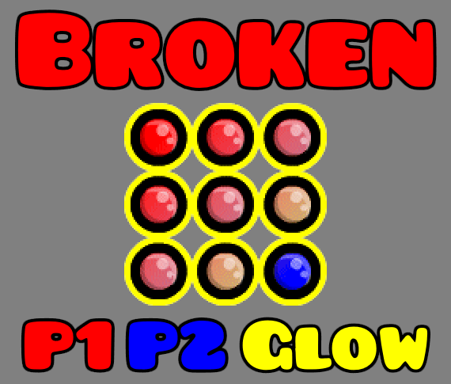

This just fixes the textures for Cube 287. The cube was originally made by me for the 2020 icon contest, and RobTop somehow messed it up when he made changes to it.

Formatted with the [Texture Loader](https://geode-sdk.org/mods/geode.texture-loader) mod in mind. If you don't use the mod, the textures are able to be plopped into the vanilla game just fine.

